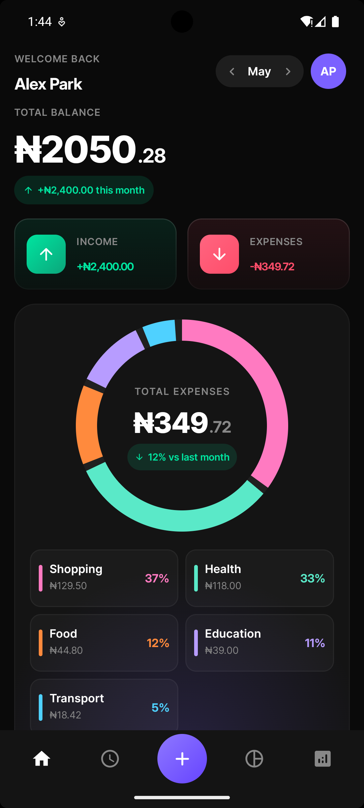
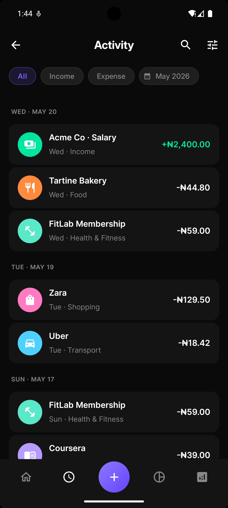
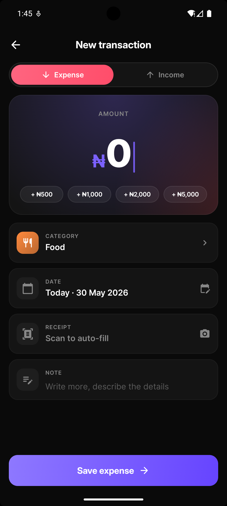
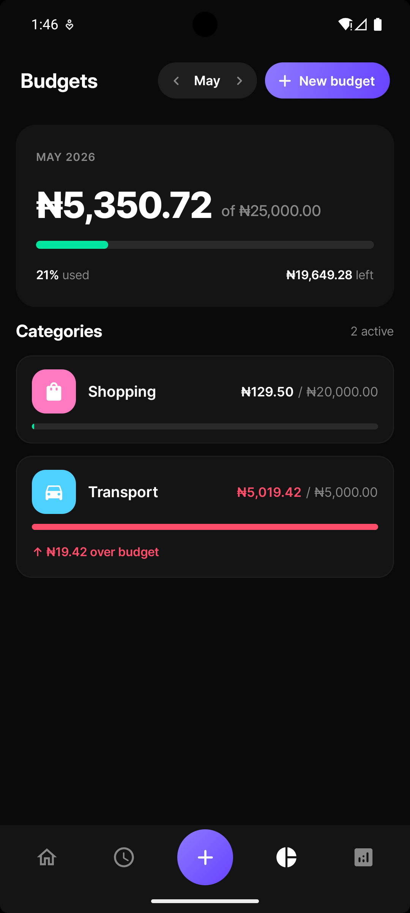
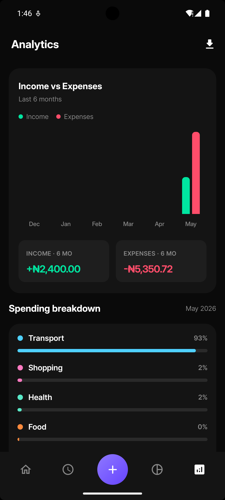
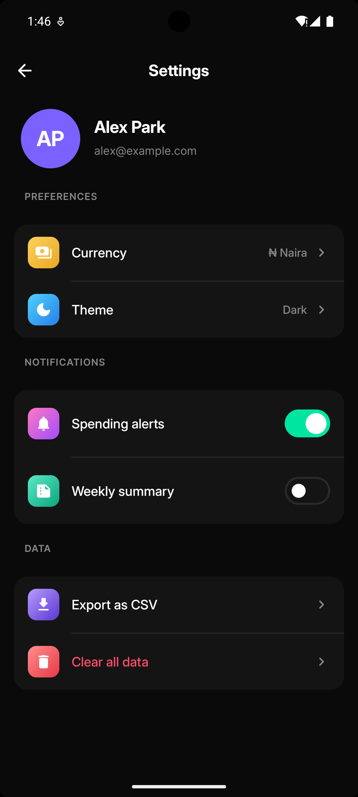

# 💜 Pennywise

> A production-grade personal finance tracker built with Jetpack Compose, Clean Architecture, and MVI.

## Images

<!-- Replace these with real screenshots from your emulator -->
| Dashboard | Transactions | Add Transaction |
|-----------|-------------|-----------------|
|  |  |  |

| Budgets | Analytics | Settings |
|---------|-----------|----------|
|  |  |  |

---

## Overview

Pennywise tracks income, expenses, budgets, and spending analytics with a reactive data layer, custom Canvas charts, and a fully adaptive UI that handles phones, tablets, foldables, and landscape orientations. The codebase is structured the way a real engineering team would ship it — separated by feature and layer with clear contracts between each boundary.

---

## Architecture

Clean Architecture + MVI across a multi-module Gradle project.

```
┌─────────────────────────────────────────────────────────────┐
│                          :app                               │
│           NavGraph · MainActivity · DI wiring               │
└───────────────────────────┬─────────────────────────────────┘
                            │
        ┌───────────────────┼───────────────────┐
        ▼                   ▼                   ▼
  :feature:dashboard  :feature:transactions  :feature:budgets
  :feature:analytics  :feature:settings      :feature:onboarding
        │                   │                   │
        └───────────────────┼───────────────────┘
                            │
               ┌────────────┼────────────┐
               ▼            ▼            ▼
          :core:ui    :core:domain   :core:data
                           │              │
                     Repository      Room · DataStore
                     interfaces      implementations
```

---

## MVI Base

Every screen shares the same `MviViewModel` base from `:core:common`:

```kotlin
abstract class MviViewModel<State, Event, Effect>(
    initialState: State
) : ViewModel() {
    val state: StateFlow<State>
    val effect: SharedFlow<Effect>

    fun onEvent(event: Event)
    protected abstract fun handleEvent(event: Event)
    protected fun setState(reducer: State.() -> State)
    protected fun setEffect(effect: Effect)
}
```

Strict unidirectional data flow enforced across every feature. The UI emits events, the ViewModel produces state and one-shot effects, the View never holds business logic.

---

## Tech Stack

| Category | Technology |
|----------|-----------|
| UI | Jetpack Compose BOM 2026.02 |
| Architecture | MVI + Clean Architecture |
| DI | Hilt 2.51 + KSP |
| Database | Room v3 with reactive Flows |
| Paging | Paging 3 with `insertSeparators` |
| Preferences | DataStore |
| Navigation | Navigation Compose 2.7 with animated transitions |
| Async | Kotlin Coroutines + Flow |
| Adaptive | androidx.window 1.3 (`WindowSizeClass` + `FoldingFeature`) |
| Charts | Custom Canvas `DonutChart` |

---

## PennywiseWindowLayout

A sealed class that encodes the current form factor by combining `WindowSizeClass` and `FoldingFeature` into one value every screen pattern-matches on:

```kotlin
sealed class PennywiseWindowLayout {
    object PhonePortrait : PennywiseWindowLayout()
    object PhoneLandscape : PennywiseWindowLayout()
    object TabletPortrait : PennywiseWindowLayout()
    object TabletLandscape : PennywiseWindowLayout()
    data class Foldable(val foldingFeature: FoldingFeature) : PennywiseWindowLayout()
}
```

`FoldingFeature` is detected via `WindowInfoTracker` — the only reliable way to distinguish a foldable from a tablet at runtime. Phone landscape is excluded from the rail via a height breakpoint check (`HEIGHT_DP_MEDIUM_LOWER_BOUND`) since width alone misclassifies rotated phones as tablets.

| Screen | Phone Portrait | Tablet Landscape | Foldable |
|--------|---------------|-----------------|----------|
| Dashboard | Single column | Balance left / Donut right | Two rows × two columns + hinge line |
| Transactions | Scroll list | Master-detail 40/60 split | Master-detail |
| Add Transaction | Full screen | Centered 480dp modal | Amount left / Fields right |
| Budgets | Card list | 2-column card grid | 2-column card grid |
| Analytics | Single column | Chart left / Breakdown right | Chart left / Breakdown right |
| Settings | Single column | Profile+Prefs left / Notifs+Data right | Two columns |

---

## Setup

### Prerequisites
- Android Studio Meerkat or later
- JDK 11+
- Android SDK 35

### Clone and run

```bash
git clone https://github.com/toluwalope19/Pennywise
cd Pennywise
```

Open in Android Studio and run on any device or emulator (API 26+). The app seeds 9 default categories on first launch via `DatabaseSeeder` — no manual setup required.

### Adaptive UI testing

- **Tablet** — use a Pixel Tablet AVD (1024×768) in Android Studio's Virtual Device Manager
- **Foldable** — use the Pixel Fold AVD, toggle fold/unfold in the Extended Controls panel
- **Landscape** — rotate any phone AVD with Ctrl+F11 / Cmd+F11

---

## Project Decisions

**Why MVI over MVVM?**
MVI's strict unidirectional flow makes every screen's behaviour predictable and testable. State is always a single immutable snapshot. Side effects (navigation, snackbars) are channelled through `SharedFlow<Effect>` so they fire exactly once.

**Why multi-module?**
Feature modules enforce architectural boundaries at the compiler level. `:feature:dashboard` cannot accidentally import from `:feature:transactions` — the build will fail. This mirrors how a real engineering team would structure a large codebase.

**Why `CategoryDisplay` instead of an enum?**
The original approach mapped categories to a `CategoryType` enum, which silently fell back to `OTHER` for custom categories. `CategoryDisplay` resolves both built-in and user-created categories from the DB — name, colour, icon — without any enum look-up. Custom categories are first-class citizens.

**Why `Flow.first()` in `ExportCsvUseCase`?**
Room's `Flow` never completes — it stays open to emit future updates. Using `.collect {}` inside a `suspend fun` hangs forever. `.first()` takes exactly one emission and cancels the collection, making it safe inside a coroutine that needs to return.

**Why `@AssistedInject` for `EditTransactionViewModel`?**
The Edit Transaction screen needs a transaction ID at construction time — from nav arguments on phone, and from master-detail selection state on tablet. `@AssistedInject` with a `Factory` interface handles both cases cleanly without reaching into `SavedStateHandle`, keeping the ViewModel testable.

**Why `pointerInput` for press scale instead of `interactionSource`?**
`interactionSource.collectIsPressedAsState()` only fires for Compose's internal press events consumed by `clickable`. Since `pressScale()` is applied on top of existing `clickable` modifiers, `pointerInput` intercepts raw pointer events independently — giving us press state without interfering with click handling.

---

## License

```
MIT License — Copyright (c) 2026 Toluwalope Ayodele
```
# Pennywise